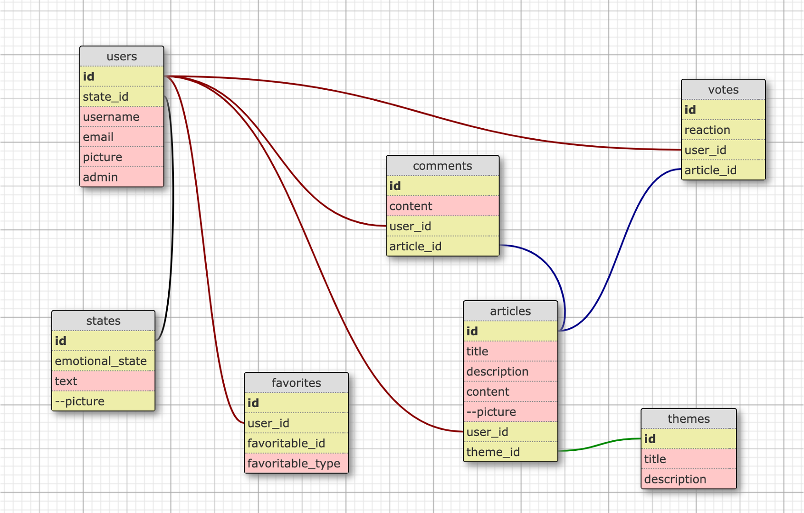
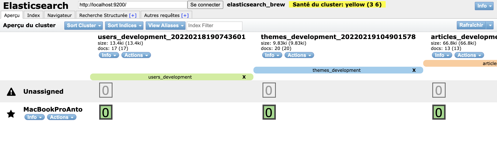
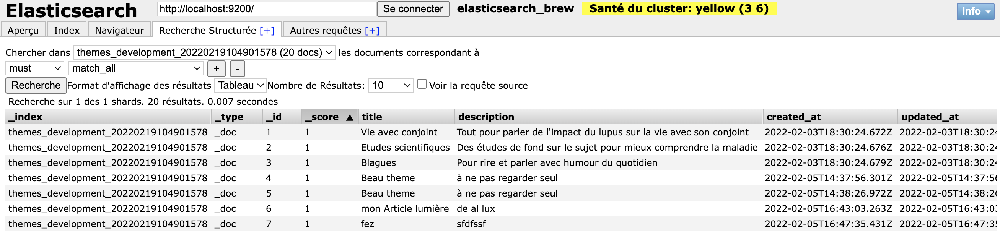
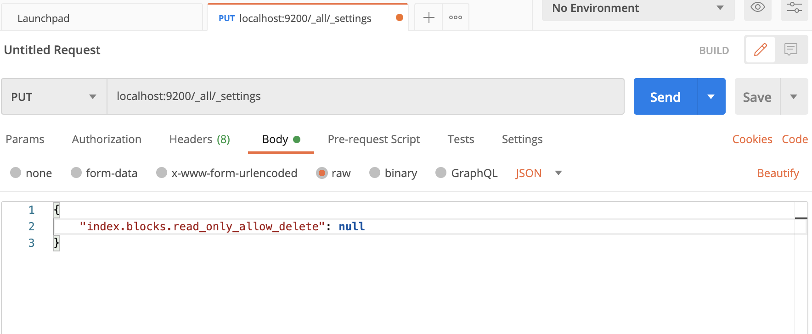

# Social Network tool attempt study.


## DB MODELS :




The polymorphic table 'favorites' was created using :

 - command line:
    ```bash
    rails g model favorite user:references details favoritable:references{polymorphic}
    ```
 - User & Theme models we've added :
     - has_many :favorites // for user table where there also another one_to_many relation with favorites
     - has_many :favorites, as: :favoritable // for theme and all other potential tables

Regarding DB:


- we use one Polymorphic table (favorites). Reminder regarding the way to create a favorite:
    - create users :
    ```bash
        us1 = User.create(email: "a@xxx", password: "secret")
        us2 = User.create(email: "b@xxx", password: "secret")
    ```
    - create a theme :
    ```bash
        th = Theme.create(title: "Second on the planet", content: "here it is" )
    ```
    - create favorites :
    ```bash
        fav1 = Favorite.create(user_id: us1.id, favoritable: th)
        fav2 = Favorite.create(user_id: us1.id, favoritable: us2)
    ```
    - recall favorites :
    ```bash
        Favorite.all
        us1.favorites (in 'rails c', it's necessary to exit and reenter to have changes takin in account)
    ```

Regarding Devise, User and pundit:

- it was important to add within the favorites controller, specific access to pundit collection policies
  ```bash
    after_action :verify_policy_scoped, only: [ :index, :index_th, :index_art ], unless: :skip_pundit?
    after_action :verify_authorized, except: [ :index, :index_th, :index_art ], unless: :skip_pundit?
  ```
- we introduced several new columns in User. User is managed by Devise. So in order to have access to those new colums we had to add specific configuration in the application_controller.rb
```bash

  before_action :configure_permitted_parameters, if: :devise_controller?

  def configure_permitted_parameters
    devise_parameter_sanitizer.permit(:sign_up, keys: user_params)
    devise_parameter_sanitizer.permit(:sign_in, keys: user_params)
    devise_parameter_sanitizer.permit(:account_update, keys: user_params)
  end

  def user_params
    %i[ email username picture admin state_id biography ].freeze
  end
```

Regarding SimpleForm :

- we have a field (state) from a second table to populate in the User profile, the description to do so is not so clear in the action view tutorial :
```bash
   <%= f.association :state, :include_blank => false, :label_method => lambda { |state| "#{state.text}" } %>
```


ElasticSearch:

- we have to install ElasticSearch on our server (see doc for mac, pc, heroku..)
- add searchkick gem


- once installed, need to add in each indexes models : searchkick specific parameters (cf https://github.com/ankane/searchkick)

Searchable Fields
By default, all string fields are searchable (can be used in fields option). Speed up indexing and reduce index size by only making some fields searchable.
```bash
class Product < ApplicationRecord
  searchkick searchable: [:name]
end
```

- we recommend to use the google chrome plugin : "ElasticSearch Head"
Enter the Elastic DB address : http://localhost:9200/ (or your remote)
it gives you ability to have an overview of your Elasticsearch DB. For example go to
<div align="center">
  
  
</div>

- in order to avoid disk storage issue (by default needs 85% free space)
```bash
  PUT /_cluster/settings
{
    "transient": {
        "cluster.routing.allocation.disk.threshold_enabled": false
    }
}
```
- after this step, Elasticsearch won’t remove the write block on indices. In order to achieve that, the following API needs to be hit:
```bash
PUT _all/_settings
{
    "index.blocks.read_only_allow_delete": null
}
```

