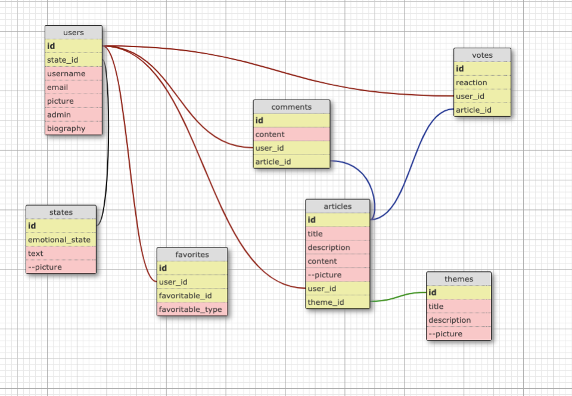

# Social Network tool attempt study.


## DB MODELS :




The polymorphic table 'favorites' was created using :
    ```bash
    rails g model favorite user:references details favoritable:references{polymorphic}
    ```
 - User & Theme models we've added :
     - has_many :favorites // for user table where there also another one_to_many relation with favorites
     - has_many :favorites, as: :favoritable // for theme and all other potential tables

Regarding DB:


- we use one Polymorphic table (favorites). Reminder regarding the way to create a favorite:
    - create users :
    ```bash
        us1 = User.create(email: "a@xxx", password: "secret")
        us2 = User.create(email: "b@xxx", password: "secret")
    ```
    - create a theme :
    ```bash
        th = Theme.create(title: "Second on the planet", content: "here it is" )
    ```
    - create favorites :
    ```bash
        fav1 = Favorite.create(user_id: us1.id, favoritable: th)
        fav2 = Favorite.create(user_id: us1.id, favoritable: us2)
    ```
    - recall favorites :
    ```bash
        Favorite.all
        us1.favorites (in 'rails c', it's necessary to exit and reenter to have changes takin in account)
    ```
